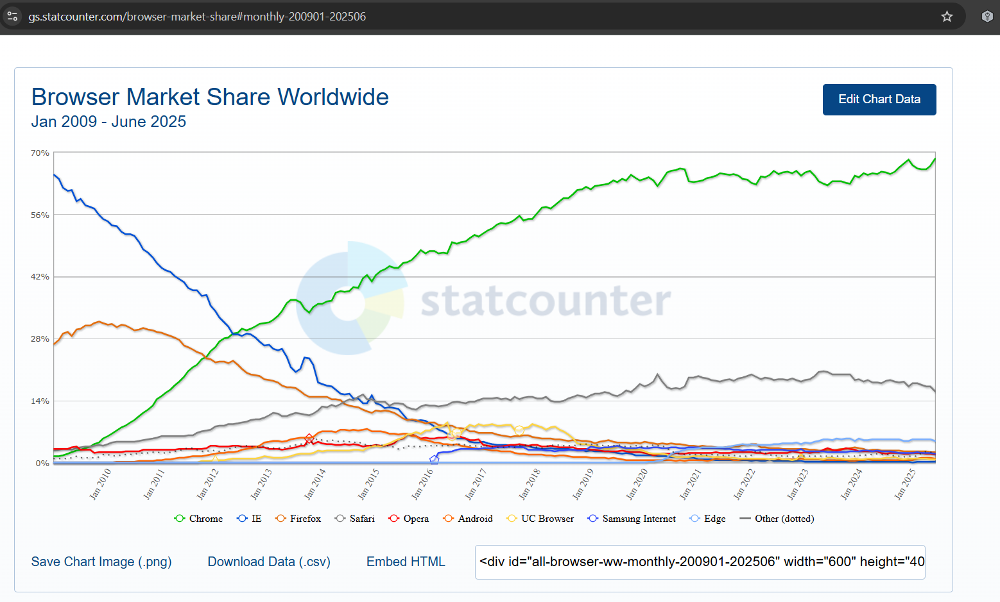
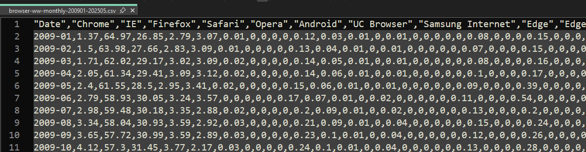
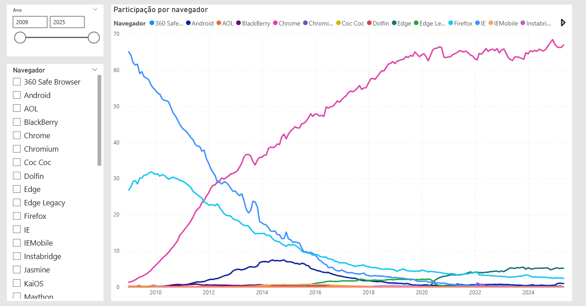

# Exemplo carga de arquivo participação dos browsers

Aqui é a reprodução dos gráficos disponíveis nesta página: https://gs.statcounter.com/

O arquivo CSV foi baixado diretamente deste site e precisa de algumas transformações:

* Transformar colunas em linhas.
* A data, vêm sem o dia, e precisa ser ajustado.
* O número tem ponto para separar decimais.

O resultado:

